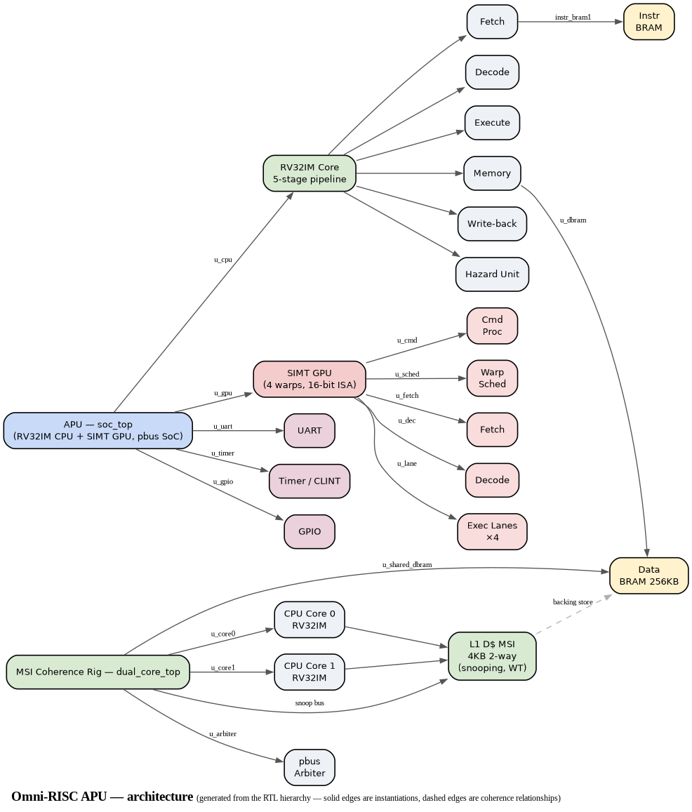

# Omni-RISC APU

A **RISC-V Accelerated Processing Unit** — an RV32IM scalar CPU fused with a SIMT GPU on a single FPGA. Solo build, verified against the official RISC-V compliance suite, synthesized on Xilinx Artix-7 (XC7A100T).



> Diagram generated from the RTL module hierarchy (`scripts/gen_arch_diagram.py`): solid edges are module instantiations, dashed edges are coherence relationships.

## Highlights

- **RV32IM CPU** — 5-stage in-order pipeline (IF/ID/EX/MEM/WB), full forwarding + hazard detection, M-extension (`mul`/`div`), M-mode CSRs + traps
- **Coherent 2-core research rig** — snooping MSI D-cache (write-through, write-invalidate), LR/SC spinlock, passed MP + SB litmus tests
- **SIMT GPU** — 4 warps × 4 lanes, 16-bit SIMT ISA, warp scheduler with latency hiding, scratchpad, vector/matmul/conv kernels
- **SoC** — UART, timer/CLINT, GPIO, pbus MMIO decode, bare-metal firmware + scheduler
- **Fits on the board** — synthesis/implementation on XC7A100T: **6,270 LUTs (9.9%), 0 LUT-mem, 64.5 BRAM tiles, 18 DSP; 50 MHz timing met → Fmax ≈ 53.5 MHz**
- **Compliance** — riscv-arch-test rv32im: **53/54** (1 skip, Zifencei `fence.i`: split I/D BRAMs)

## Architecture

- **CPU**: RV32IM, 5-stage in-order pipeline, full forwarding + hazard detection, M-extension, M-mode CSRs + traps
- **Coherence rig** (`dual_core_top`): two cores sharing one `data_bram` through a snooping MSI D-cache and pbus arbiter — the coherence experiments that the APU's coarse-grained GPU sync builds on
- **GPU**: SIMT engine (4 warps × 4 lanes), INT ALU, scratchpad memory, warp scheduler with latency hiding
- **Bus**: peripheral bus (pbus) with MMIO decode — CPU ↔ UART/timer/GPIO ↔ GPU
- **Target**: Xilinx Artix-7 (XC7A100T), Vivado 2026.1 synthesis flow

## Verification

| Area | Result |
|------|--------|
| ISA compliance | riscv-arch-test rv32im 53/54 |
| CPU pipeline | tb_cpu_top 83/83 |
| L1 caches | tb_cache 14/14, tb_icache 27/27 |
| MSI coherence | tb_dual_spin (counter → 1000, no lost updates), litmus MP + SB 200/200 each |
| GPU kernels | tb_gpu_top_kernels 66/66 (vector_add, relu, matmul, conv2d) |
| SoC end-to-end | tb_soc_gpu: CPU launches GPU over pbus, reads result 42, firmware prints `PASS` |

## Project Structure

```
hardware/rtl/cpu/     — RISC-V CPU core (5-stage pipeline, caches, CSRs, 2-core MSI)
hardware/rtl/gpu/     — SIMT GPU (warp scheduler, exec lanes, scratchpad)
hardware/rtl/memory/  — instruction/data BRAM
hardware/rtl/soc/     — UART, CLINT timer, GPIO, SoC integration (soc_top, dual_core_top)
hardware/rtl/bus/     — pbus_arbiter (2-core arbitration)
hardware/sim/         — Verilator testbenches + run_sim.sh driver
firmware/             — bare-metal RISC-V firmware (boot, drivers, apps, GPU kernels)
scripts/              — elf_to_hex.py, gpu_asm.py (16-bit SIMT assembler)
tests/                — riscv-arch-test compliance runner, GPU kernel tests
docs/                 — architecture and design docs (read roadmap.md first)
```

## Quick Start

```bash
# Build + run a single testbench (Verilator)
make sim TB=cpu/tb_alu
# or directly, with waveforms:
./hardware/sim/run_sim.sh cpu/tb_alu --wave

# Cross-compile firmware
make firmware              # default APP=hello

# RISC-V compliance suite (53/54)
make compliance

# Vivado synthesis + implementation (place+route)
make synth                 # needs Vivado on PATH or make VIVADO=...
make impl
```

## Requirements

- Verilator >= 5.0
- riscv64-linux-gnu-gcc (rv32 multilib)
- GTKWave (waveforms)
- Vivado 2026.1 (synthesis/implementation; override path with `make VIVADO=...`)
- Python 3 (`pip install -r requirements.txt`)

## Build Phases

| Phase | What | Status |
|-------|------|--------|
| A | CPU core: pipeline → hazards → M-ext → CSRs/traps → compliance (53/54) | ✅ |
| B | SoC: UART, timer/CLINT, GPIO, firmware, bare-metal scheduler | ✅ |
| C | L1 caches (I$ direct-mapped, D$ 2-way write-through) | ✅ |
| D | 2-core snooping MSI coherence, LR/SC spinlock, litmus | ✅ |
| E | SIMT GPU: scheduler, lanes, kernels, SoC integration | ✅ |
| F | Coherent-APU integration (unified memory, flush/invalidate) | 🔧 in progress |
| G | Synthesis + timing closure on Artix-7 (Vivado) | ✅ |

## License

_To be added._

## References

- RISC-V ISA Manual
- riscv-arch-test (official compliance suite)
