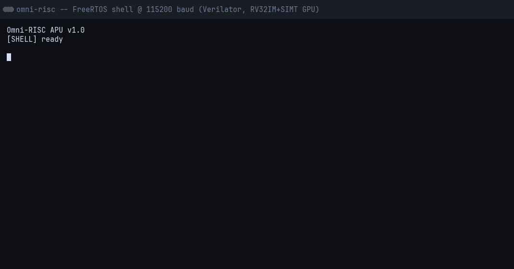

# Omni-RISC APU

A **RISC-V Accelerated Processing Unit** — an RV32IM scalar CPU fused with a SIMT GPU on a single FPGA. Solo build, verified against the official RISC-V compliance suite, synthesized on Xilinx Artix-7 (XC7A100T).


> Diagram generated from the RTL module hierarchy (`scripts/gen_arch_diagram.py`): solid edges are module instantiations, dashed edges are coherence relationships.

## Highlights

- **RV32IM CPU** — 5-stage in-order pipeline (IF/ID/EX/MEM/WB), full forwarding + hazard detection, M-extension (`mul`/`div`), M-mode CSRs + traps
- **Coherent 2-core research rig** — snooping MSI D-cache (write-through, write-invalidate), LR/SC spinlock, passed MP + SB litmus tests
- **SIMT GPU** — 4 warps × 4 lanes, 16-bit SIMT ISA, warp scheduler with latency hiding, scratchpad, vector/matmul/conv kernels, warp-level `BARRIER` sync
- **SoC** — UART, timer/CLINT, GPIO, pbus MMIO decode, bare-metal firmware + scheduler
- **FreeRTOS** — V10.5.1 preemptive RTOS on the core (M-mode CLINT port): measured 1.84 µs ISR latency, 9.84 µs context switch, interactive UART shell
- **Fits on the board** — synthesis/implementation on XC7A100T: **~7,639 LUTs (12.1%) incl. 1,586 LUT-as-memory, 2,484 FF, 64.5 BRAM tiles, 15 DSP; 50 MHz timing met (WNS +1.253ns) → Fmax ≈ 53.4 MHz**
- **Compliance** — riscv-arch-test rv32im: **53/54** (1 skip, Zifencei `fence.i`: split I/D BRAMs)

## Interactive demo — a shell on the APU

You can type into a FreeRTOS shell running on the RV32IM core, inside the Verilator simulation, over a bit-accurate UART. `tb_soc_shell` feeds stdin at real 115200 framing (434 clk/bit — no zero-delay cheat), so the RTL deserializer sees genuine UART waveforms:



```bash
./tests/test_shell.sh        # scripted session gate (non-interactive, CI-friendly)
./scripts/console.sh         # live terminal: raw-mode, type like minicom (Ctrl-C quits)
```

**Shell commands** (`help` lists them all):

| Command | What it does |
|---------|--------------|
| `help` | list commands |
| `uptime` | seconds since boot (tick counter) |
| `ps` | list FreeRTOS tasks (`uxTaskGetSystemState`) |
| `ticks` | live tick-jitter histogram from the tick hook |
| `gpu` | write A/B into the GPU scratchpad, launch vector-add over MMIO, poll to completion, print checksum |
| `peek`/`poke`/`mdump` | read/write/dump memory at a hex address |
| `gpio` | read/write GPIO |
| `mtime` | read the CLINT timer |
| `heap` | report FreeRTOS heap usage |
| `reboot` | reset the SoC |
| `quit` | end the simulation (no fixed cycle cap) |

The `gpu` command exercises the CPU↔GPU coherent shared-memory window end-to-end. The session is replayable with `asciinema play docs/shell_session.cast`.

> **Terminal notes**: `console.sh` puts your terminal in raw mode (`stty raw -echo`). The shell firmware echoes each character locally, so you see what you type once. Backspace (DEL) works — the firmware erases the last character. Tab is not supported (no completion); it's silently dropped. If you see every character doubled, a second echo source is active — check your terminal emulator's local-echo setting.

## Architecture

- **CPU**: RV32IM, 5-stage in-order pipeline, full forwarding + hazard detection, M-extension, M-mode CSRs + traps
- **Coherence rig** (`dual_core_top`): two cores sharing one `data_bram` through a snooping MSI D-cache and pbus arbiter — the coherence experiments that the APU's coarse-grained GPU sync builds on
- **GPU**: SIMT engine (4 warps × 4 lanes), INT ALU, scratchpad memory, warp scheduler with latency hiding, warp-level `BARRIER`
- **CPU↔GPU shared-memory window**: the CPU writes kernel inputs into the warp's scratchpad and reads results back through `gpu_cmd_proc` host registers — no copies, coarse-grained coherence at kernel boundaries
- **FreeRTOS V10.5.1** — preemptive RTOS on the core (M-mode CLINT port): measured 1.8 µs ISR latency, 9.8 µs context switch, interactive UART shell
- **Bus**: peripheral bus (pbus) with MMIO decode — CPU ↔ UART/timer/GPIO ↔ GPU
- **Target**: Xilinx Artix-7 (XC7A100T), Vivado 2026.1 synthesis flow

Full hardware/software architecture: [`docs/architecture.md`](docs/architecture.md)

## Verification

| Area | Result |
|------|--------|
| ISA compliance | riscv-arch-test rv32im 53/54 |
| CPU pipeline | tb_cpu_top 83/83 |
| L1 caches | tb_cache 14/14, tb_icache 27/27 |
| MSI coherence | tb_dual_spin (counter → 1000, no lost updates), litmus MP + SB 200/200 each |
| GPU kernels | tb_gpu_top_kernels 118/118 (vector_add, relu, matmul, conv2d, barrier) |
| GPU barrier | 4-warp sync: every warp writes PRE, barriers, resumes, writes POST — no deadlock, all markers present; lone-warp no-deadlock diag |
| SoC end-to-end | tb_soc_gpu: CPU writes A/B into GPU scratchpad, launches vector-add kernel over pbus, reads C back — `C = A + B` per lane |
| FreeRTOS | tb_soc_rtos: real preemptive RTOS (V10.5.1, M-mode port) — two tasks preempt correctly, tick timing cycle-accurate |
| RTOS metrics | ISR latency 92 cyc avg (1.84 µs), 2-switch yield round trip 492 cyc (9.84 µs), tick jitter ±194 cyc over 1200+ ticks |
| RTOS + GPU | tb_soc_rtos_q: 1000 items through a depth-8 `xQueue` in strict order; shell `gpu` command + ISR-semaphore path |
| Interactive shell | tb_soc_shell + tests/test_shell.sh: typed FreeRTOS shell over honest-baud UART, GPU kernel launched from a shell command |

## How the testbenches work

Everything runs through **Verilator**: each testbench is a small **C++ harness** that drives the RTL module directly through its ports, checks results, and exits `0` on pass.

```
hardware/sim/<path>/tb_<name>.cpp   — the C++ harness
hardware/rtl/**/<name>.v            — the DUT (module name == file name)
```

- `./hardware/sim/run_sim.sh <path>/tb_<name>` compiles the harness + DUT with Verilator, runs it, and reports **PASS/FAIL from the exit code** (`0` = pass).
- The DUT is auto-derived from the TB name — but some TB names map to a different top module (baked into `run_sim.sh`):

  | TB name | DUT |
  |---------|-----|
  | `tb_soc_*` | `soc_top` |
  | `tb_cache` | `l1_dcache` |
  | `tb_icache` | `l1_icache` |
  | `tb_compliance` | `cpu_top` |
  | `tb_dual_*` / `tb_litmus_*` | `dual_core_top` |
  | `tb_gpu_top_*` | `gpu_top` |
  | `tb_uart_rx` | `uart` |

- Verilator flags: `--cc --exe --trace --Wall -Wno-UNUSED -Wno-UNDRIVEN`; build output lands in `hardware/sim/obj_dir_<tb>`, waveforms in `hardware/sim/waves/<tb>.vcd`.
- **The RTL conforms to the TB, not the other way round** — port names and instruction encodings are fixed by the existing TBs (e.g. the ALU opcode map is defined by `tb_alu.cpp`). When adding a module, match the harness it must pass.
- Some TBs auto-stage firmware/GPU hex (`tb_soc_gpu`, `tb_soc_shell`, `tb_dual_spin`); after `make clean` (which deletes all `*.hex`) re-run the affected TB so the staged images are regenerated.

### Running things

```bash
# One testbench (make wrapper)
make sim TB=cpu/tb_alu

# Direct, with waveform + GTKWave
./hardware/sim/run_sim.sh cpu/tb_alu --wave

# The interactive shell (type into the simulated APU)
./scripts/console.sh
./tests/test_shell.sh          # scripted, non-interactive gate

# The full GPU kernel battery (vector_add, relu, matmul, conv2d, barrier)
./hardware/sim/run_sim.sh gpu/tb_gpu_top_kernels
```

### Adding a new testbench

1. Write `hardware/sim/<path>/tb_<name>.cpp` with the module under test instantiated via Verilator's generated header (`V<dut>.h`).
2. Keep the DUT file at `hardware/rtl/**/<name>.v` with `module name(...)` matching the file name.
3. `./hardware/sim/run_sim.sh <path>/tb_<name>` — it auto-derives the DUT, builds, runs, reports PASS/FAIL.
4. Exit `0` = pass, non-zero = fail; `run_sim.sh` turns that into the final verdict.

## GPU ISA and kernels

The GPU is a SIMT engine: **4 warps × 4 lanes**, each warp with its own 8-register × 4-lane file and a 4-bank scratchpad (lane *l* → bank *l*). Instructions are 16-bit:

```
[15:12]op [11:9]rd [8:6]rs1 [5:3]rs2 [2:0]f3

op 0  ALU     f3: ADD SUB AND OR XOR SLT SLTU SLL
op 1  LSU     bit0: 0 = LD rd <- sp[rs1], 1 = ST sp[rs1] <- rs2
op 2  BR      instr[7:0] = byte target (warp-level, no lane predication)
op 3  MUL     legacy alias for multiply
op 4  ALU2    f3: SRL SRA MUL
op 5  LDI     rd <- signext(instr[8:0])
op 6  BARRIER warp-level sync: wait for all active warps to arrive
op F  HALT
```

Kernels are written in `firmware/gpu_kernels/*.S` and assembled with `scripts/gpu_asm.py`:

```bash
python3 scripts/gpu_asm.py firmware/gpu_kernels/my_kernel.S
# -> firmware/gpu_kernels/my_kernel.hex   ($readmemh image)
```

The `.hex` is either **flashed into GPU IMEM at synthesis time** (the `IMEM_FILE` parameter, `gpu_demo.hex` — there is no runtime code download yet) or **loaded directly by a testbench** (e.g. `tb_gpu_top_kernels` calls `HEX("vector_add", 0x000)`). Reference vectors for the RTL TBs are generated by `tests/test_gpu_kernels.py`.

The `BARRIER` opcode parks a warp in a WAIT state until every active warp has issued its own `BARRIER`, then releases them together (a lone warp passes immediately; a warp that never reaches the barrier deadlocks the group — undefined behavior, same as CUDA). See [`docs/gpu_design.md`](docs/gpu_design.md) for the microarchitecture.

## Project Structure

```
hardware/rtl/cpu/     — RISC-V CPU core (5-stage pipeline, caches, CSRs, 2-core MSI)
hardware/rtl/gpu/     — SIMT GPU (warp scheduler, exec lanes, scratchpad, BARRIER)
hardware/rtl/memory/  — instruction/data BRAM
hardware/rtl/soc/     — UART, CLINT timer, GPIO, SoC integration (soc_top, dual_core_top)
hardware/rtl/bus/     — pbus_arbiter (2-core arbitration)
hardware/sim/         — Verilator testbenches + run_sim.sh driver
firmware/             — bare-metal RISC-V firmware (boot, drivers, apps, GPU kernels)
scripts/              — elf_to_hex.py, gpu_asm.py (16-bit SIMT assembler)
tests/                — riscv-arch-test compliance runner, GPU kernel tests, shell gate
docs/                 — architecture, gpu_design, memory_map, compliance results
```

## Quick Start

```bash
# Build + run a single testbench (Verilator)
make sim TB=cpu/tb_alu

# Cross-compile firmware
make firmware              # default APP=hello; apps live in firmware/apps/
make firmware APP=rtos     # FreeRTOS apps (rtos, rtos_q, rtos_sem, shell)

# RISC-V compliance suite (53/54)
make compliance

# Vivado synthesis + implementation (place+route)
make synth                 # needs Vivado on PATH or make VIVADO=...
make impl
```

## Requirements

- Verilator >= 5.0
- riscv64-linux-gnu-gcc (rv32 multilib)
- GTKWave (waveforms)
- Vivado 2026.1 (synthesis/implementation; override path with `make VIVADO=...`)
- Python 3 (`pip install -r requirements.txt`)

## Where to look for details

| Topic | Doc |
|-------|-----|
| System architecture + coherence story | [`docs/architecture.md`](docs/architecture.md) |
| CPU pipeline spec + bring-up order | [`docs/cpu_design.md`](docs/cpu_design.md) |
| GPU microarchitecture + ISA | [`docs/gpu_design.md`](docs/gpu_design.md) |
| SoC address map (pbus decode) | [`docs/memory_map.md`](docs/memory_map.md) |
| riscv-arch-test results | [`docs/compliance_results.md`](docs/compliance_results.md) |
| FreeRTOS port notes + bug postmortems | [`docs/rtos_bringup.md`](docs/rtos_bringup.md) |
| Locked plan, priority tiers | [`docs/history/roadmap.md`](docs/history/roadmap.md) |

## License

Apache-2.0 — see [LICENSE](LICENSE).

## References

- RISC-V ISA Manual
- riscv-arch-test (official compliance suite)